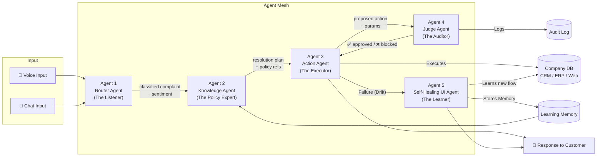
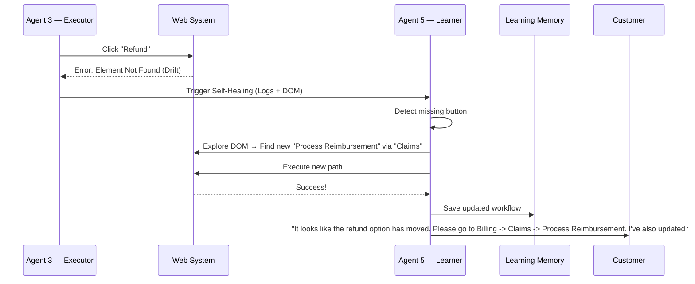

# Vani-Flow — Product Requirements Document (PRD) v2.0

**Project:** Vani-Flow — Autonomous Resolution Engine  
**Hackathon:** Economic Times Gen AI Hackathon  
**Problem Statement:** PS 2 — Agentic AI for Autonomous Enterprise Workflows  
**Date:** 29 March 2026  
**Version:** 2.0  

---

## 1. One-Line Summary

Vani-Flow is a **voice-first, multi-agent autonomous resolution system** that not only resolves customer issues end-to-end, but also adapts to UI/documentation changes and teaches users how to solve similar issues in the future.

---

## 2. Problem We Are Solving

| Pain Point | Current State | What Vani-Flow Does |
|---|---|---|
| Slow resolution | Humans manually triage and fix L1 tickets → 15-30 min avg. | Agents auto-resolve in < 2 min |
| High cost | Large L1 support teams | Automates ~70 % of repetitive tickets |
| SLA breaches | Overloaded queues → missed deadlines | Real-time routing + escalation prevents breaches |
| No audit trail | Decisions live in Slack threads & emails | Structured, machine-readable audit log for every action |
| Data privacy risk | Cloud-based LLMs see customer PII | Small models run **locally** — data never leaves the company |
| **UI / Documentation Drift** | Buttons, workflows, and dashboards change frequently; automation breaks silently | Detects failures, learns new UI path autonomously |
| **Non-tech-savvy user friction**| Users struggle with updated UI, raising repeated tickets | Teaches users the new steps dynamically |
| **No learning loop** | Systems don’t remember past failures | Remembers adapted workflows to fix recurring issues instantly |

> **Problem Explanation:** Enterprise systems frequently evolve—UI layouts change, buttons are renamed, and workflows shift. When this happens, both automation systems and human users (especially non-technical users) struggle to adapt. This leads to failed automated executions, increased manual effort, and repeated support tickets for the same issue. There is currently no mechanism to detect, adapt, and teach users these changes. Vani-Flow solves this gap perfectly.

---

## 3. Target Users

| User | How they interact |
|---|---|
| **End Customer** | Speaks/types complaint via a web widget. If a workflow has changed, receives guided instructions on the new process. |
| **L2/L3 Support Agent** | Receives escalated cases with a pre-drafted "Recovery Plan" |
| **Operations Manager** | Views the audit dashboard to track resolution rates, SLA health, agent decisions |

---

## 4. System Architecture — The 5-Agent Mesh



### 4.1 Agent 1 — Router Agent (The Listener)
| Item | Detail |
|---|---|
| **Job** | Accept voice/chat input → produce clean text + metadata |
| **Processing** | 1. STT transcription 2. Sentiment/stress detection 3. Intent classification 4. Priority tagging |
| **Outputs** | `{ transcript, intent, category, sentiment_score, priority }` |

### 4.2 Agent 2 — Knowledge Agent (The Policy Expert)
| Item | Detail |
|---|---|
| **Job** | Look up company policies + past tickets to find the correct resolution |
| **Processing** | 1. RAG retrieval over KB 2. **Query Learning Memory** for recent workflow adaptations 3. Generate Resolution Plan |
| **Outputs** | `{ resolution_plan, matched_policy_ids, similar_tickets, confidence_score }` |

### 4.3 Agent 3 — Action Agent (The Executor)
| Item | Detail |
|---|---|
| **Job** | Execute the resolution plan against company systems |
| **Processing** | 1. Map to API/UI calls 2. Execute sequentially 3. On failure → retry 4. **On persistent UI failure → trigger Agent 5** |
| **Outputs** | `{ actions_taken[], status, error_log[], customer_response_text }` |

### 4.4 Agent 4 — Judge Agent (The Auditor)
| Item | Detail |
|---|---|
| **Job** | Validate that every proposed action is safe, compliant, and within bounds |
| **Processing** | 1. Check policy guardrails 2. Verify identity 3. Flag anomalies 4. Write audit log entry |
| **Outputs** | `{ verdict: "approved" | "blocked" | "escalate", reason, audit_entry }` |

### 4.5 Agent 5 — Self-Healing UI Agent (The Learner) ⚡ NEW
| Item | Detail |
|---|---|
| **Job** | Adapt to system changes, reduce repeated failures, and teach users |
| **Inputs** | Failed execution logs from Agent 3, Recovery Plan object, UI state (DOM/screenshots) |
| **Processing** | 1. **Failure Analysis:** Detect why action failed (missing button, API change). 2. **UI Exploration (Web-focused):** Parse DOM to identify alternative elements. 3. **Workflow Reconstruction:** Rebuild correct sequence. 4. **Validation Loop:** Simulate/retry action using new steps. 5. **Memory Storage:** Save updated workflow. 6. **User Guidance Generation:** Convert steps into simple, human-readable instructions. |
| **Outputs** | `{ status: "resolved_with_adaptation", updated_flow, user_guidance, memory_saved: true }` |

---

## 5. End-to-End User Flow

### 5.1 Happy Path (Routine Complaint)
1. Customer speaks complaint.
2. Router parses it → Knowledge retrieves policy → Judge approves → Executor processes. 
3. Customer receives confirmation.

### 5.2 Error Recovery Path (Backend Down)
1. Executor fails 3 times due to 503 error.
2. Generates Recovery Plan, Judge escalates to Human.
3. Human reviews pre-drafted plan and approves with 1 click.

### 5.3 System Drift & Adaptation Path (UI Changed) ⚡ NEW


If the **same issue repeats**, the Knowledge Agent uses the Learning Memory to skip failure and *directly* use the updated flow.

---

## 6. Data Models

### 6.1 Complaint Object
```json
{
  "complaint_id": "CMP-20260329-00142",
  "intent": "refund_status",
  "priority": "routine",
  "sentiment_score": 0.45 
}
```

### 6.2 Adaptive Memory Object ⚡ NEW
```json
{
  "issue_type": "refund",
  "old_flow": "Click Dashboard -> Refund",
  "new_flow": "Click Billing -> Claims -> Process Reimbursement",
  "ui_changes_detected": true,
  "confidence": 0.92
}
```

---

## 7. Tech Stack & Platform Scope

| Layer | Technology |
|---|---|
| **Platform Scope** | **Web Applications** (web dashboards, CRM, ERP, admin panels) |
| **SLMs** | Oumi-fine-tuned models (< 10B params, local) |
| **Speech-to-Text** | Whisper (local) or Bhashini API |
| **RAG Vector Store** | ChromaDB or FAISS |
| **UI Parser (Agent 5)**| DOM parsing (HTML structure), semantic text similarity |
| **Orchestrator** | Python + LangGraph / custom mesh controller |
| **Backend API** | FastAPI |
| **Frontend** | React / Next.js for Demo UI |
| **Database** | PostgreSQL |

---

## 8. Component Ownership

> [!IMPORTANT]
> Suggested module split for your team. Ensure someone owns Agent 5's DOM traversal logic early.

| Module | Key Tasks | Suggested Owner |
|---|---|---|
| **Agent 1 (Router) & Agent 2 (Knowledge)** | STT, intent tagging, RAG pipeline, KB memory integration | Person A |
| **Agent 3 (Executor) & Agent 4 (Judge)** | API/UI mock actions, guardrails, audit logging | Person B |
| **Agent 5 (Learner)** | Web DOM parsing, failure analysis, self-healing orchestration | Person C |
| **Orchestrator & Memory** | LangGraph mesh wiring, Learning Memory vector DB | Person A + C |
| **Frontend & Infra** | React dashboard, Chat/Voice UI, Docker setup | Person B + D |

---

## 9. How We Score on Judging Criteria (Upgraded)

- **🚀 Depth of Autonomy (Enhanced):** Handles dynamic system changes, not just static, predefined workflows.
- **🔁 Error Recovery (Best-in-Class):** Doesn't just blindly retry; it learns, adapts, and figures out the new process autonomously.
- **📊 Auditability (Richer):** Logs failure reasons, the exact UI changes detected, and the newly adapted path.
- **🌍 Real-World Applicability (Massively Improved):** Enterprise apps constantly change UI. Vani-Flow handles tech failures and bridges human friction by teaching users the new workflows.

---

## 10. Demo Script (With Agent 5 Adaptation)

1. **Speak a complaint:** _"I haven't received my refund."_
2. **Simulate UI Drift:** Rename the "Refund" mock endpoint or button label to "Process Reimbursement" via an admin panel or hidden toggle.
3. **Agent 3 Fails:** Executor attempts the standard action but throws `ElementNotFound`.
4. **Agent 5 Takes Over:** Show Agent 5 analyzing the DOM, discovering the new path under Billing -> Claims.
5. **Self-Healing Success:** Agent 5 executes successfully and outputs guided instructions to the chat: _"It looks like the refund option has moved. Please go to Billing -> Claims -> Process Reimbursement. I've also updated this for future requests."_
6. **Repeat Test:** Trigger the same request again and show Agent 2 pulling the updated flow from **Learning Memory** instantly—*without* any initial failure.

---

## 11. Killer Positioning Line

> **"Vani-Flow doesn’t just automate workflows—it learns when systems change, adapts in real-time, and even teaches users how to navigate the new interface."**

---

## 12. Future Extensions
- **Vision-based UI understanding** (GPT-4V style) instead of DOM parsing.
- **Cross-platform support** for mobile application adaptation.
- **Auto-documentation updater** to proactively modify company FAQs and SOPs based on learned UI changes.
- **Federated learning** to share UI adaptation knowledge across different tenants or departments.
